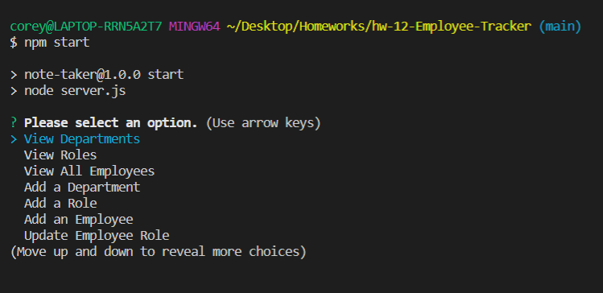
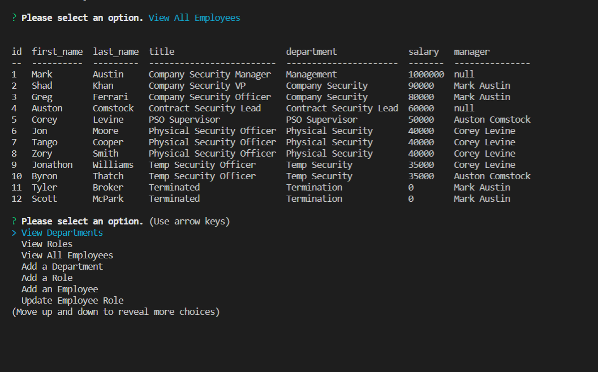

# hw-12-Employee-Tracker
EMPLOYEE TRACKER

Purpose:
The follow applicaion is a Node.js and MySQL based system that allows the user to create a postion for an employee, as well as track current employees, the employees in a department, the positions of the employee, the salary of the employee, and allow the user to make adjustment to any exisiting employees title and positon.

Usage:
For the proper usage of the app, one will need to have Inquirer, MySQL and Node installed onto their device to be able to access it via MySQL.

Location:

Video:
Repo: https://github.com/coreylevine2000/hw-12-Employee-Tracker

Images:

